# AREP Property CRUD System

Sistema CRUD completo para la gestión de propiedades inmobiliarias desarrollado con Spring Boot, MySQL y Frontend JavaScript vanilla.

## Repositorio independiente que contiene el código de las clases de evidencia y tutoriales de JPA del taller de AWS-CLI
```
https://github.com/juan-beltran0518/AWS-CLIWorkshops.git
```

## Descripción del Proyecto

Este proyecto implementa un sistema completo de gestión de propiedades inmobiliarias que permite realizar operaciones CRUD (Create, Read, Update, Delete) sobre propiedades. Fue desarrollado como parte del curso AREP (Arquitecturas Empresariales) con un enfoque en arquitecturas distribuidas y despliegue en la nube.

## Video de Demostración

### Demostración de Funcionalidades


[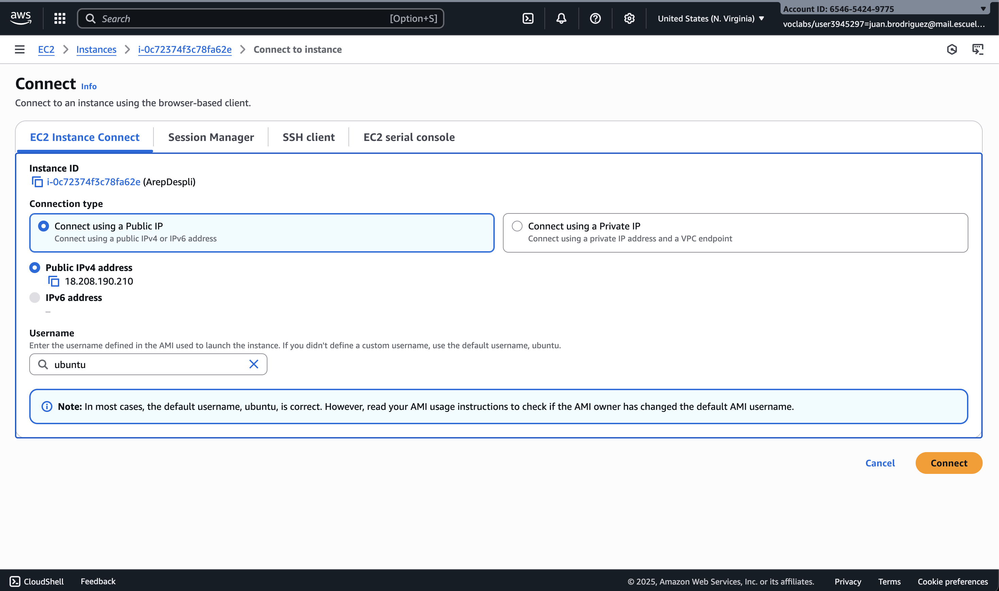]([ruta-del-video])

### Copiar URL Para Ver Demostración de Funcionalidades (Se recomienda poner en X1.5 o X2)
```
https://pruebacorreoescuelaingeduco-my.sharepoint.com/:v:/g/personal/juan_brodriguez_mail_escuelaing_edu_co/ERYLxH1QTjhKoOpsEmljLSwBrNVgkIywUvwG6tLMwf1mPg?nav=eyJyZWZlcnJhbEluZm8iOnsicmVmZXJyYWxBcHAiOiJPbmVEcml2ZUZvckJ1c2luZXNzIiwicmVmZXJyYWxBcHBQbGF0Zm9ybSI6IldlYiIsInJlZmVycmFsTW9kZSI6InZpZXciLCJyZWZlcnJhbFZpZXciOiJNeUZpbGVzTGlua0NvcHkifX0&e=FCVlMh
```

### Funcionalidades Principales

- **Gestión completa de propiedades** (Crear, Leer, Actualizar, Eliminar)
- **API REST** completa con validaciones robustas
- **Frontend responsivo** con JavaScript vanilla
- **Filtros de búsqueda** por dirección, precio y área
- **Validaciones** del lado cliente y servidor
- **Base de datos MySQL** con JPA/Hibernate
- **Despliegue en AWS** con arquitectura distribuida

## Tecnologías Utilizadas

### Backend
- **Java 21** - Lenguaje de programación
- **Spring Boot 3.5.6** - Framework principal
- **Spring Data JPA** - Persistencia de datos
- **Spring Boot Validation** - Validaciones
- **MySQL** - Base de datos relacional
- **Maven** - Gestión de dependencias

### Frontend
- **HTML5** - Estructura
- **CSS3** - Estilos responsivos
- **JavaScript (Vanilla)** - Lógica del cliente
- **Fetch API** - Comunicación con backend

### Despliegue
- **AWS EC2** - Servidor de aplicación
- **AWS RDS MySQL** - Base de datos en la nube
- **Maven** - Construcción y empaquetado

## Arquitectura del Sistema

```
arepcrudsystem/
├── src/main/java/arep/edu/co/arepcrudsystem/
│   ├── ArepcrudsystemApplication.java    # Clase principal
│   ├── controller/
│   │   └── PropertyController.java       # Controlador REST
│   ├── dto/
│   │   └── PropertyDTO.java             # Objeto de transferencia
│   ├── model/
│   │   └── Property.java                # Entidad JPA
│   ├── repository/
│   │   └── PropertyRepository.java      # Repositorio de datos
│   └── service/
│       └── PropertyService.java         # Lógica de negocio
├── src/main/resources/
│   ├── application.properties           # Configuración principal
│   ├── application-aws.properties       # Configuración AWS
│   └── static/
│       ├── index.html                   # Frontend principal
│       ├── css/styles.css              
│       └── js/properties.js            
└── src/test/
    └── java/arep/edu/co/arepcrudsystem/
        └── ArepcrudsystemApplicationTests.java
```

## Modelo de Datos

### Entidad Property

| Campo | Tipo | Descripción | Validaciones |
|-------|------|-------------|--------------|
| `id` | Long | Identificador único | Auto-generado |
| `address` | String | Dirección de la propiedad | Requerido, 5-500 caracteres |
| `price` | Double | Precio de la propiedad | Requerido, > 0 |
| `size` | Double | Área en m² | Requerido, ≥ 1 |
| `description` | String | Descripción detallada | Opcional, máx. 1000 caracteres |
| `ownerName` | String | Nombre del propietario | Opcional, máx. 100 caracteres |

## API REST Endpoints

### Base URL: `/api/properties`

| Método | Endpoint | Descripción | Request Body | Response |
|--------|----------|-------------|--------------|----------|
| `GET` | `/` | Obtener todas las propiedades | - | `List<PropertyDTO>` |
| `GET` | `/{id}` | Obtener propiedad por ID | - | `PropertyDTO` |
| `POST` | `/` | Crear nueva propiedad | `PropertyDTO` | `PropertyDTO` |
| `PUT` | `/{id}` | Actualizar propiedad | `PropertyDTO` | `PropertyDTO` |
| `DELETE` | `/{id}` | Eliminar propiedad | - | `200 OK` |

### Ejemplo de Request/Response

**POST /api/properties**
```json
{
  "address": "Calle 123 #45-67, Bogotá",
  "price": 350000000.0,
  "size": 120.5,
  "description": "Apartamento moderno con 3 habitaciones",
  "ownerName": "Juan Pérez"
}
```
**Visualización Postman Maquina Local**

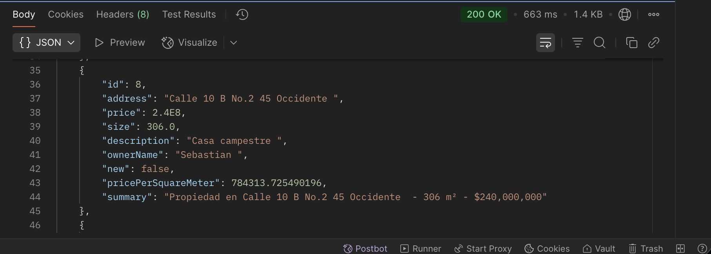

## Interfaz de Usuario

El frontend incluye:

- **Formulario de creación/edición** con validaciones en tiempo real
- **Lista de propiedades** con opciones de ver, editar y eliminar
- **Filtros de búsqueda** por dirección, precio y área

- **Feedback instantáneo** para todas las operaciones

## Configuración y Despliegue

### Requisitos Previos
- Java 21+
- Maven 3.6+
- MySQL 8.0+
- AWS CLI (para despliegue)

### Configuración Local

1. **Clonar el repositorio**
```bash
git clone https://github.com/juan-beltran0518/ArePpropertyCrudSystem.git
cd ArePpropertyCrudSystem
```

2. **Configurar base de datos MySQL**
```sql
CREATE DATABASE properties_db;
```

3. **Actualizar configuración**
```properties
# src/main/resources/application.properties
spring.datasource.username=tu_usuario
spring.datasource.password=tu_password
```

4. **Ejecutar la aplicación**
```bash
./mvnw spring-boot:run
```

5. **Acceder a la aplicación**
```
http://localhost:8080
```

**Visualización De Configuración (Codigo Personal)**

```
spring.application.name=arepcrudsystem

# MySQL Database Configuration
spring.datasource.url=jdbc:mysql://localhost:3306/properties_db?createDatabaseIfNotExist=true&useSSL=false&serverTimezone=UTC&allowPublicKeyRetrieval=true
spring.datasource.username=
spring.datasource.password=
spring.datasource.driver-class-name=com.mysql.cj.jdbc.Driver
spring.jpa.hibernate.ddl-auto=update
spring.jpa.show-sql=true
```


### Configuración AWS

1. **Crear instancia EC2**
```bash
# Subir JAR a EC2
scp -i clave.pem target/arepcrudsystem-0.0.1-SNAPSHOT.jar ubuntu@IP_EC2:/home/ubuntu/
```

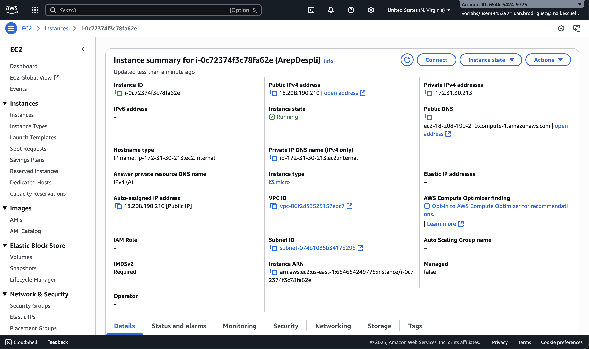


2. **Configurar RDS MySQL**
```properties
# application-aws.properties
spring.datasource.url=jdbc:mysql://rds-endpoint:3306/properties_db
```

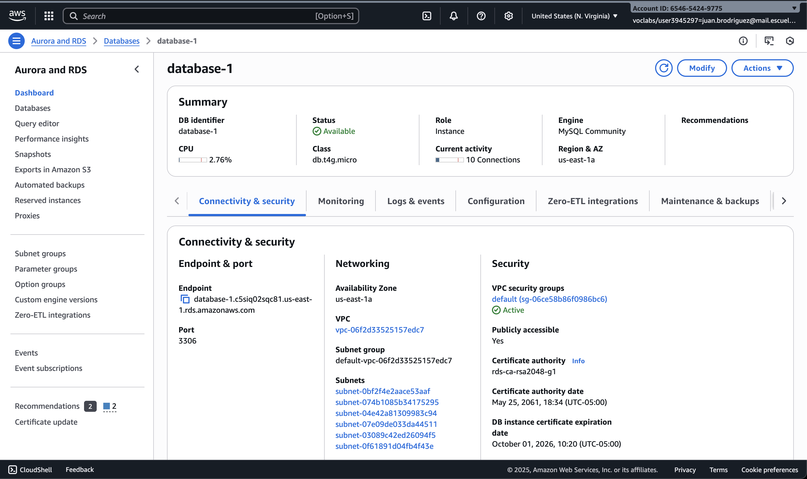


3. **Ejecutar en EC2**
```bash
java -jar arepcrudsystem-0.0.1-SNAPSHOT.jar --spring.profiles.active=aws
```

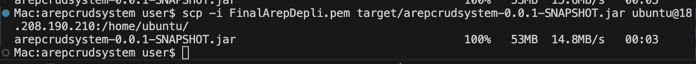

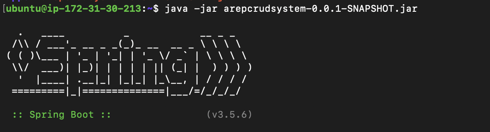


### Testing Manual
1. Verificar todas las operaciones CRUD
2. Probar validaciones del formulario
3. Verificar filtros de búsqueda
4. Probar responsive design

## Screenshots

### Interfaz Principal
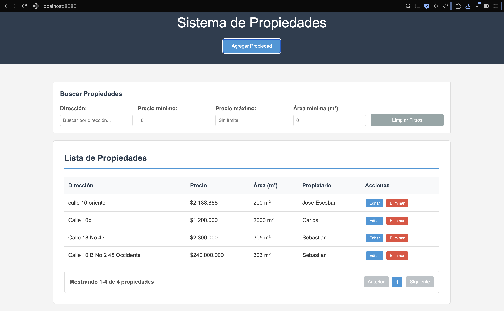
*Interfaz principal con lista de propiedades y filtros de búsqueda*

### Formulario de Creación
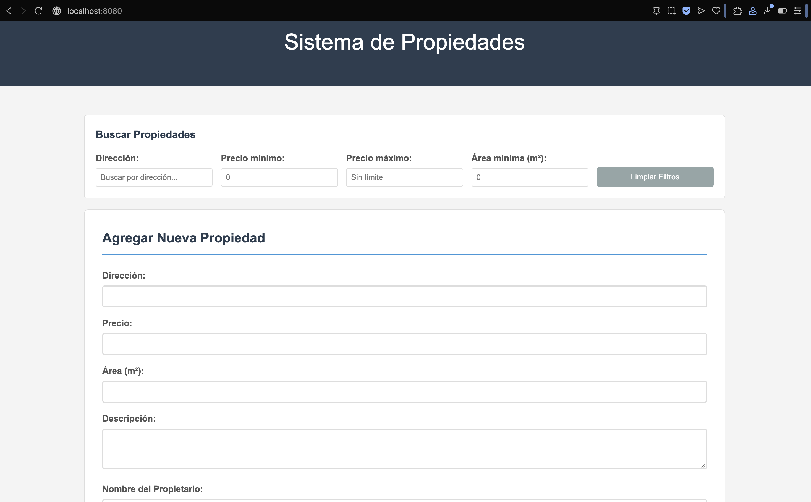
*Formulario para agregar nueva propiedad con validaciones*

### Vista de Detalles
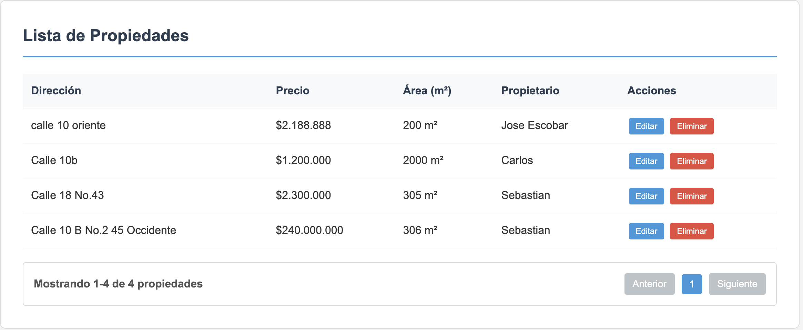
*Modal con detalles completos de la propiedad*

### Formulario de Edición
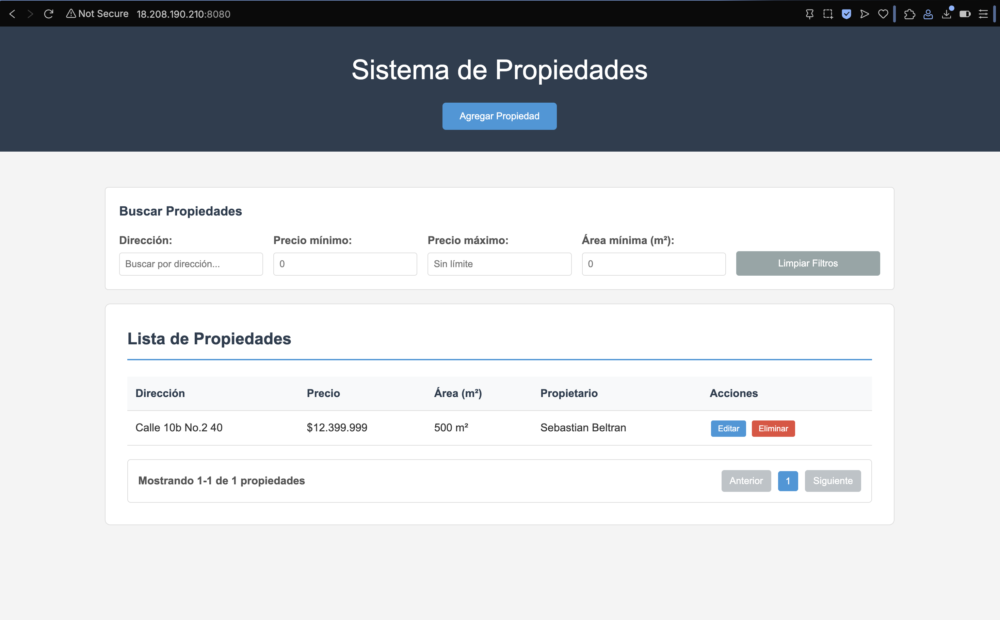
*Formulario de edición pre-poblado con datos existentes*

### Grupos de Seguridad

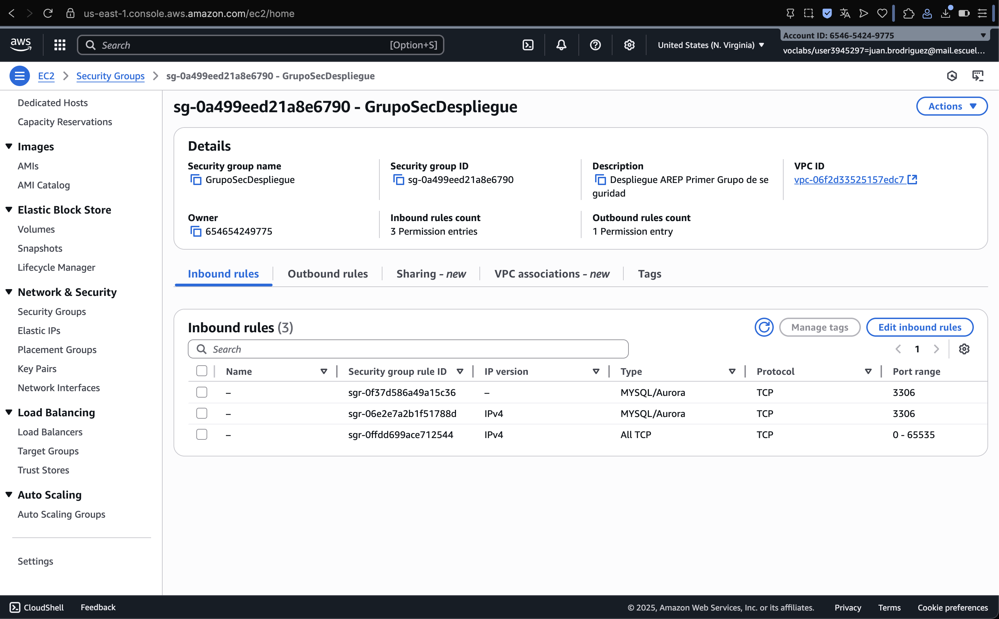

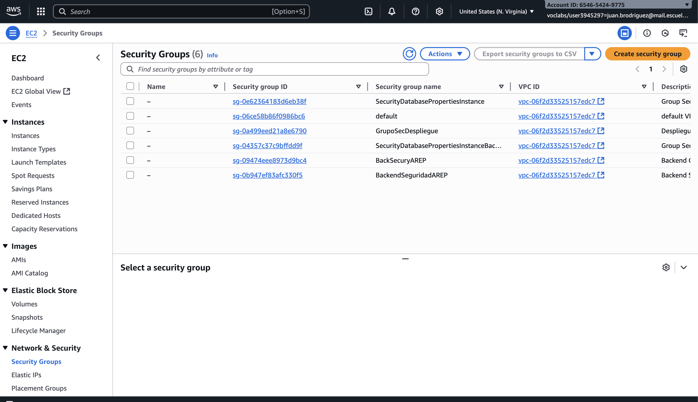


### Funcionamiento CRUD

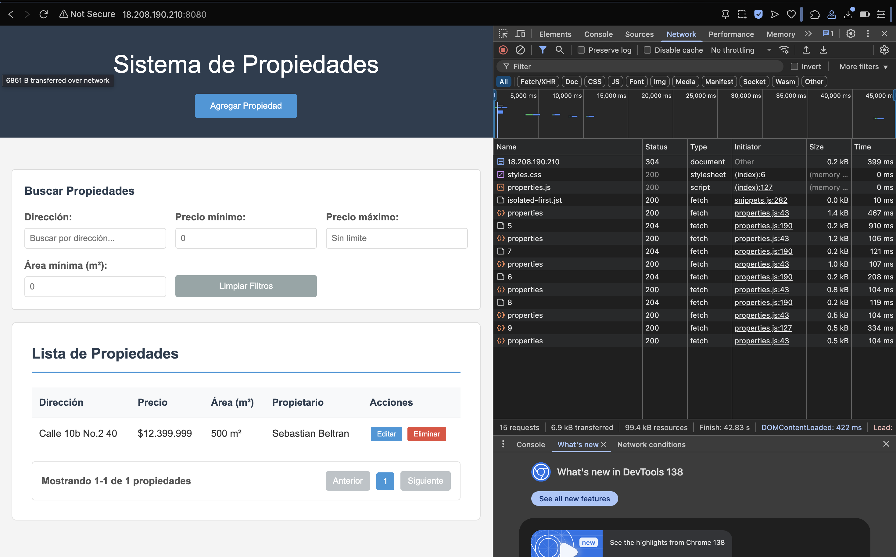

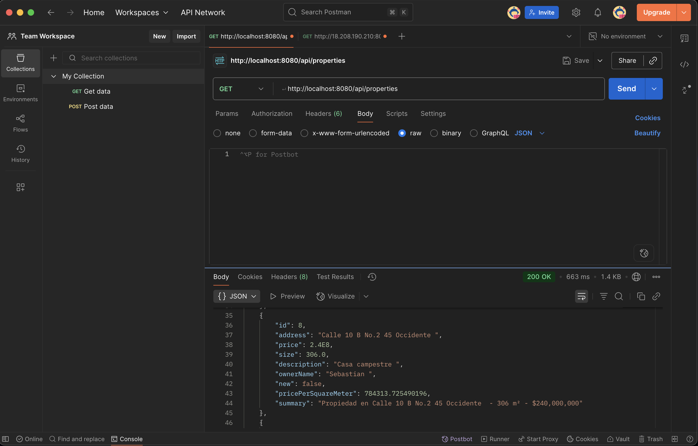

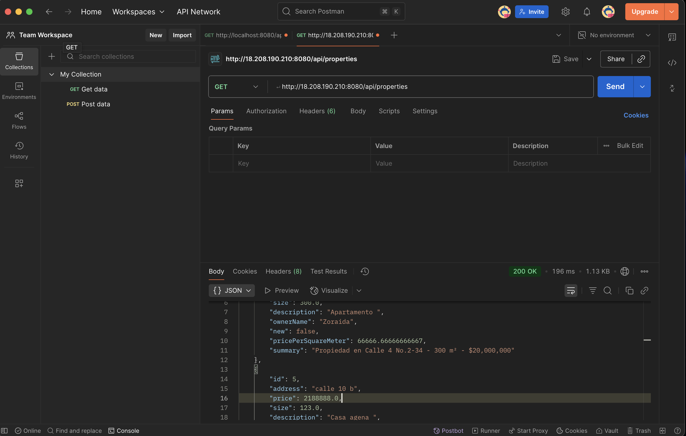

### Funcionamiento Base de Datos RDS

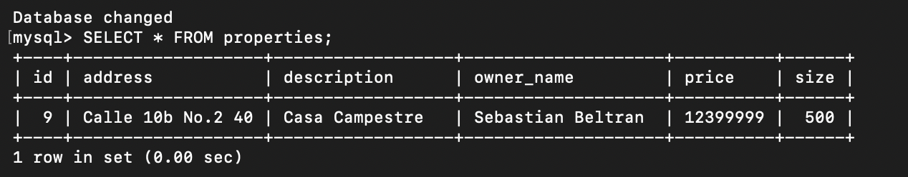

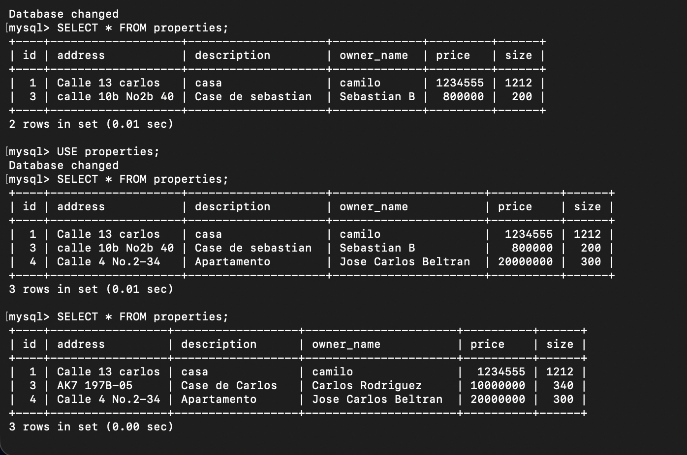

### Arquitectura AWS


## Características Técnicas

### Validaciones Implementadas
- **Frontend**: Validación en tiempo real con JavaScript
- **Backend**: Bean Validation con anotaciones Jakarta
- **Base de datos**: Restricciones de integridad

### Manejo de Errores
- **HTTP Status Codes** apropiados
- **Mensajes de error** descriptivos
- **Logging** completo de errores

### Seguridad
- **CORS** configurado para desarrollo
- **Validación de entrada** en todos los endpoints
- **Sanitización** de datos de entrada

### Performance
- **Índices de base de datos** en campos frecuentemente consultados
- **Lazy loading** en consultas JPA
- **Compresión** de respuestas HTTP


## Autor

**Sebastian Beltran**
- 📧 Email: juan.beltran0518@hotmail.com
- 🐙 GitHub: [@juan-beltran0518](https://github.com/juan-beltran0518)
- 🎓 Universidad: Escuela Colombiana de Ingeniería Julio Garavito

## Referencias y Documentación

- [Spring Boot Documentation](https://spring.io/projects/spring-boot)
- [Spring Data JPA Reference](https://spring.io/projects/spring-data-jpa)
- [MySQL Documentation](https://dev.mysql.com/doc/)
- [AWS EC2 Documentation](https://docs.aws.amazon.com/ec2/)
- [AWS RDS Documentation](https://docs.aws.amazon.com/rds/)

---
